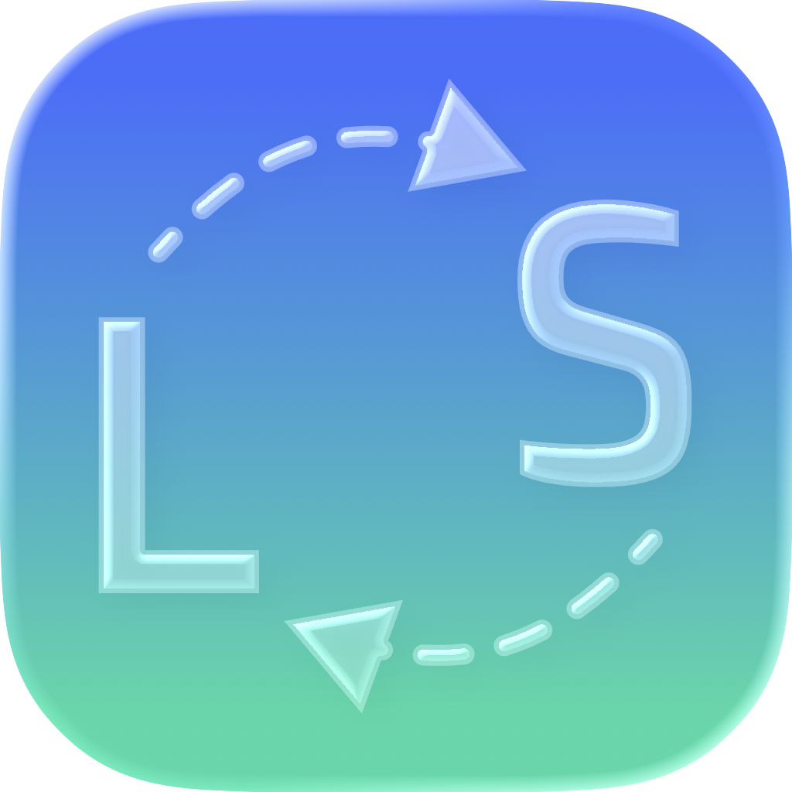

  

<h1 align="center">LangSwitcher</h1>

  A lightweight macOS menu bar app that automatically fixes keyboard layout mistakes between English, Cyrillic, and Chinese.

---

> [!WARNING]
> **Accessibility Permission Required**
> LangSwitcher uses the macOS Accessibility API to intercept and replace keystrokes. You must grant Accessibility access in **System Settings → Privacy & Security → Accessibility** before the app can function. The app will prompt you on first launch.

> [!NOTE]
> **App Signing**
> Builds from source are unsigned by default. On first launch macOS may block the app with a *"cannot be opened because the developer cannot be verified"* message. To bypass it, go to **System Settings → Privacy & Security** and click **Open Anyway**, or run `xattr -dr com.apple.quarantine /path/to/LangSwitcher.app` in Terminal.

---

## Features

| | |
|---|---|
| **Cyrillic ⇄ English** | Fixes layout mix-ups between Cyrillic (Russian / Ukrainian) and QWERTY keyboards |
| **Chinese → English** | Detects English typed while a Chinese Pinyin IME is active and switches layout |
| **Force Convert** | Press your shortcut mid-word to instantly convert without waiting for Space |
| **Text Shortcuts** | Define trigger words that expand into full phrases automatically |
| **Smart Validation** | Uses macOS spell-check dictionaries to avoid false positives |
| **Auto Layout Switch** | Switches the active keyboard layout automatically after each correction |
| **Ukrainian Support** | Full ЙЦУКЕН + Ukrainian extras — `ґ`, `і`, `ї`, `є` |
| **Launch at Login** | Optional setting to start LangSwitcher automatically on login |
| **Correction Counter** | Tracks and displays the total number of corrections made |

## How It Works

LangSwitcher installs a global `CGEventTap` at the session level. As you type, it buffers the current word and on Space or Enter checks it against macOS spell-check dictionaries:

- **Cyrillic → English** — Cyrillic characters are mapped back to their QWERTY equivalents
- **English → Cyrillic** — QWERTY characters are mapped to the matching Cyrillic word (Russian or Ukrainian)
- **Chinese → English** — if a Chinese Pinyin IME is active and the buffered word is a valid English word, the layout is switched and the word is retyped in English

Only genuine mistakes are corrected — valid words in the current script are left untouched.

## Requirements

- macOS 13 Ventura or later
- Accessibility permission (prompted on first launch)

